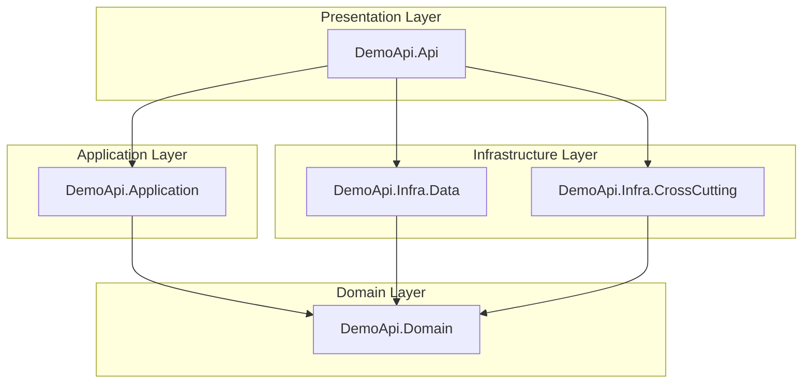
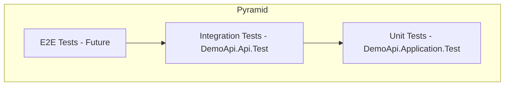

# Demo API - Architecture Documentation

[](https://dotnet.microsoft.com/)
[](https://docs.microsoft.com/en-us/dotnet/csharp/)
[](LICENSE)
[]()

A demonstration RESTful API built with **.NET 8** showcasing enterprise-grade software architecture patterns, clean code principles, and industry best practices. This project serves as a reference implementation for building scalable, maintainable, and testable Web APIs.

---

## 📋 Table of Contents

- [Architecture Overview](#architecture-overview)
- [Project Structure](#project-structure)
- [Design Patterns & Principles](#design-patterns--principles)
- [Layer Responsibilities](#layer-responsibilities)
- [API Design](#api-design)
- [Testing Strategy](#testing-strategy)
- [Technologies & Libraries](#technologies--libraries)
- [Getting Started](#getting-started)
- [API Endpoints](#api-endpoints)

---

## 🏗️ Architecture Overview

This project implements a **Clean Architecture** (also known as Onion Architecture), enforcing a strict separation of concerns where the **Domain** is the heart of the software.

### Dependency Inversion Principle (DIP)

A key characteristic of this architecture is the application of the **Dependency Inversion Principle**. 
- The **Domain Layer** defines the contracts (Interfaces) for data persistence and other external services.
- The **Infrastructure Layer** depends on the Domain and implements these interfaces.
- The **Application Layer** depends only on the Domain and abstractions, never on concrete infrastructure details.

This ensures that the core business logic remains agnostic to external technologies (like databases or APIs), making the system highly testable and adaptable.

### Architectural Diagram



*Note: The API references Infrastructure only for Dependency Injection (Composition Root).*

---

## 📁 Project Structure

```text
src/
├── DemoApi.Api/                    # Presentation Layer (Web API)
│   ├── Configuration/              # DI, Swagger, AutoMapper setup
│   ├── Controllers/                # API Endpoints
│   └── Program.cs                  # Composition Root
│
├── DemoApi.Application/            # Application Layer
│   ├── Services/                   # Business orchestration
│   ├── Models/                     # ViewModels/DTOs
│   └── Automapper/                 # Mapping profiles
│
├── DemoApi.Domain/                 # Domain Layer (Core)
│   ├── Entities/                   # Business Objects
│   ├── Interfaces/                 # Repository & Service Contracts
│   └── Handlers/                   # Notification Handler
│
├── DemoApi.Infra.Data/             # Infrastructure Layer
│   └── Repositories/               # Data access implementation
│
└── DemoApi.Infra.CrossCutting/     # Cross-Cutting Concerns
    └── Logging/                    # Logger implementation

tests/
├── DemoApi.Api.Test/               # Integration Tests
│   └── Factories/                  # WebApplicationFactory setup
│
└── DemoApi.Application.Test/       # Unit Tests
    └── Products/                   # Service logic tests
```

---

## 🎨 Design Patterns & Principles

### SOLID Principles

| Principle | Implementation |
|-----------|----------------|
| **Single Responsibility (SRP)** | Each class has one reason to change. Controllers handle HTTP, Services handle business logic, Repositories handle data access. |
| **Open/Closed (OCP)** | Classes are open for extension but closed for modification through abstractions and interfaces. |
| **Liskov Substitution (LSP)** | Derived classes can substitute base classes. `ProductRepository` implements `IProductRepository`. |
| **Interface Segregation (ISP)** | Clients depend only on interfaces they use. `IProductRepository` is specific to Product operations. |
| **Dependency Inversion (DIP)** | High-level modules depend on abstractions. Controllers depend on `IProductAppService`, not concrete implementations. |

### Key Patterns Implemented

#### 1. **Repository Pattern**
Abstracts the data access logic. The domain defines `IProductRepository`, and the infrastructure implements it.
*Current implementation uses an In-Memory storage for demonstration purposes, but can be easily swapped for Entity Framework Core or Dapper without changing a single line of business logic.*

```csharp
public interface IProductRepository
{
    Task<IList<Product>> GetAll();
    Task<Product?> GetById(uint id);
    Task<Product> Create(Product product);
    // ...
}
```

#### 2. **Notification Pattern (Domain Notifications)**
Instead of throwing exceptions for business validation errors (which is costly and breaks control flow), the project uses a `NotificatorHandler`.
- Errors are accumulated during the request.
- The controller checks for notifications before returning a response.
- Result: Consistent HTTP 400/422 responses with a standard error format.

```csharp
public class NotificatorHandler : INotificatorHandler
{
    private readonly List<Notification> _errors;
    // ...
    public void AddError(string error)
    {
        _errors.Add(new Notification(error));
    }
}
```

#### 3. **Service Layer**
The `ProductAppService` acts as a facade for the domain. It orchestrates the flow:
1. Receives DTOs.
2. Maps to Domain Entities.
3. Validates business rules.
4. Calls Repositories.
5. Returns DTOs.

```csharp
public class ProductAppService : BaseServices, IProductAppService
{
    // ...
    public async Task<ProductViewModel?> Create(ProductViewModel product)
    {
        // Validation and Orchestration Logic
    }
}
```

#### 4. **DTOs (Data Transfer Objects)**
`ProductViewModel` is used to decouple the internal Domain Entities from the external API contract. This allows the domain model to evolve independently of the API.

```csharp
public class ProductViewModel : BaseViewModel
{
    [Required(ErrorMessage = "Name is required")]
    public required string Name { get; set; }
    // ...
}
```

#### 5. **Dependency Injection**
All dependencies are registered in the IoC container and injected via constructors.

```csharp
public static IServiceCollection AddDependencyInjectionConfig(this IServiceCollection services)
{
    services.AddScoped<IProductAppService, ProductAppService>();
    services.AddScoped<IProductRepository, ProductRepository>();
    // ...
}
```

#### 6. **Factory Pattern (Testing)**
`CustomWebApplicationFactory` creates test server instances for integration testing.

```csharp
public class CustomWebApplicationFactory : WebApplicationFactory<Program>
{
}
```

---

## 📚 Layer Responsibilities

### Presentation Layer (`DemoApi.Api`)

**Responsibility:** Handle HTTP requests/responses and delegate to application services.

| Component | Purpose |
|-----------|---------|
| `MainApiController` | Base controller with standardized response handling |
| `ProductController` | RESTful endpoints for Product operations |
| `ExceptionMiddleware` | Global exception handling and logging |
| `ApiConfig` | API versioning and behavior configuration |
| `SwaggerConfig` | OpenAPI documentation setup |
| `DependencyInjectionConfig` | IoC container registration |

**Key Features:**
- **Global Exception Handling**: The `ExceptionMiddleware` intercepts unhandled exceptions, logs them using `NLog`, and returns a standardized `500 Internal Server Error` response in JSON format. This prevents sensitive stack traces from leaking to the client.
- **Configuration Extension Methods**: `Program.cs` is kept clean and readable by moving configuration logic into extension methods (e.g., `AddApiConfig`, `AddDependencyInjectionConfig`). This follows the "Convention over Configuration" approach and separates startup concerns.

### Application Layer (`DemoApi.Application`)

**Responsibility:** Orchestrate use cases, map between domain and presentation models.

| Component | Purpose |
|-----------|---------|
| `ProductAppService` | Product CRUD operations orchestration |
| `ProductViewModel` | API contract for Product data |
| `ResponseViewModel` | Standardized API response wrapper |
| `AutomapperConfig` | Entity-ViewModel mappings |

### Domain Layer (`DemoApi.Domain`)

**Responsibility:** Define core business entities, rules, and contracts.

| Component | Purpose |
|-----------|---------|
| `Entity` | Base class for domain entities |
| `Product` | Product aggregate root |
| `Notification` | Domain notification model |
| `NotificatorHandler` | Notification accumulator |
| `INotificatorHandler` | Notification contract |

### Infrastructure Layer (`DemoApi.Infra.*`)

**Responsibility:** Implement technical capabilities (data access, logging, external services).

| Component | Purpose |
|-----------|---------|
| `IProductRepository` | Product-specific repository contract (Implementation) |
| `ProductRepository` | In-memory product storage implementation |
| `NLogLogger` | NLog implementation |

---

## 🌐 API Design

### Response Envelope Pattern

All API responses follow a consistent structure (Envelope Pattern), making it easier for clients to handle success and error states uniformly.

```json
{
    "success": true,
    "data": { ... },
    "errors": []
}
```

| Field | Type | Description |
|-------|------|-------------|
| `success` | `boolean` | Indicates if the operation was successful. |
| `data` | `object` | The payload of the response (null if error). |
| `errors` | `string[]` | List of error messages (business validations or exceptions). |

### HTTP Status Codes

| Status Code | Usage |
|-------------|-------|
| `200 OK` | Successful GET requests. |
| `201 Created` | Successful POST (create) requests. |
| `204 No Content` | Successful PUT/DELETE requests. |
| `400 Bad Request` | Business rule violations or invalid syntax. |
| `404 Not Found` | Resource not found. |
| `412 Precondition Failed` | Model validation errors (e.g., missing required fields). |
| `500 Internal Server Error` | Unexpected server errors. |

### API Versioning Strategy

The API implements **URL Path Versioning** to ensure backward compatibility and smooth evolution of endpoints.

- **Format**: `/api/v{version}/{resource}`
- **Current Version**: `v1`
- **Default Behavior**: If no version is specified, the API assumes the default version (v1).

---

## 🧪 Testing Strategy

The project employs a comprehensive testing strategy ensuring reliability at all levels.

### Test Pyramid



### 1. Unit Tests (`DemoApi.Application.Test`)
Focus on the **Application Layer** and **Business Rules**.
- **Tools**: xUnit, Moq, FluentAssertions, Bogus.
- **Strategy**: All external dependencies (Repositories, Notificator) are mocked. We test the logic in isolation.

**Example (AAA Pattern):**
```csharp
[Fact]
public async Task Create_ShouldReturnProduct_WhenRepositoryCreatesSuccessfully()
{
    // Arrange
    var (notificator, productRepository, productApplication) = SetProductAppService();
    var productFake = NewProduct();
    // ... Setup Mocks ...

    // Act
    var result = await productApplication.Create(productViewModel);

    // Assert
    result.Should().NotBeNull();
    result.Name.Should().Be(productFake.Name);
}
```

### 2. Integration Tests (`DemoApi.Api.Test`)
Focus on the **API Endpoints** and the full request lifecycle.
- **Tools**: Microsoft.AspNetCore.Mvc.Testing (`WebApplicationFactory`).
- **Strategy**: Spins up an in-memory test server. Real HTTP requests are sent to the API to verify status codes, response bodies, and correct wiring of the dependency injection container.

**Example:**
```csharp
[Fact]
public async Task Create_ShouldReturnCreated_WhenProductIsValid()
{
    // Arrange
    var url = "/api/v1/products";
    var productFake = NewProduct();

    // Act
    var result = await HttpClientHelper.PostAndEnsureSuccessAsync(_client, url, productFake);

    // Assert
    result.StatusCode.Should().Be(HttpStatusCode.Created);
}
```

---

## 🛠️ Technologies & Libraries

### Core Framework
| Technology | Version | Purpose |
|------------|---------|---------|
| .NET | 8.0 | Runtime and SDK |
| C# | 12.0 | Programming language |
| ASP.NET Core | 8.0 | Web framework |

### API & Documentation
| Library | Version | Purpose |
|---------|---------|---------|
| Swashbuckle.AspNetCore | 6.6.2 | Swagger/OpenAPI generation |
| Microsoft.AspNetCore.Mvc.Versioning | 5.0.0 | API versioning |

### Data & Mapping
| Library | Version | Purpose |
|---------|---------|---------|
| AutoMapper | 12.0.1 | Object-to-object mapping |
| Newtonsoft.Json | 13.0.4 | JSON serialization |

### Logging
| Library | Version | Purpose |
|---------|---------|---------|
| NLog.Web.AspNetCore | 6.1.0 | Structured logging |

### Testing
| Library | Version | Purpose |
|---------|---------|---------|
| xUnit | 2.5.3 | Test framework |
| Moq | (Latest) | Mocking framework |
| FluentAssertions | 8.8.0 | Assertion library |
| Bogus | 34.0.2 | Fake data generation |
| Microsoft.AspNetCore.Mvc.Testing | 8.0.22 | Integration test host |

---

## 🚀 Getting Started

### Prerequisites
- [.NET 8 SDK](https://dotnet.microsoft.com/download/dotnet/8.0)

### Installation

1. **Clone the repository**
   ```bash
   git clone https://github.com/lucasbarbosa/Demo-Api.git
   cd Demo-Api
   ```

2. **Restore dependencies**
   ```bash
   dotnet restore
   ```

3. **Run the Application**
   ```bash
   dotnet run --project src/DemoApi.Api
   ```
   The API will start at `https://localhost:5001` (or similar, check console output).

4. **Run Tests**
   ```bash
   dotnet test
   ```

---

## 📡 API Endpoints

### Products API (`/api/v1/products`)

| Method | Endpoint | Description |
|--------|----------|-------------|
| `GET` | `/api/v1/products` | Get all products |
| `GET` | `/api/v1/products/{id}` | Get product by ID |
| `POST` | `/api/v1/products` | Create new product |
| `PUT` | `/api/v1/products` | Update product |
| `DELETE` | `/api/v1/products/{id}` | Delete product |

### Example Request (Create Product)

**POST** `/api/v1/products`

```json
{
  "name": "Premium Widget",
  "weight": 1.5
}
```

**Response (201 Created)**

```json
{
  "success": true,
  "data": {
    "id": 1,
    "name": "Premium Widget",
    "weight": 1.5
  },
  "errors": []
}
