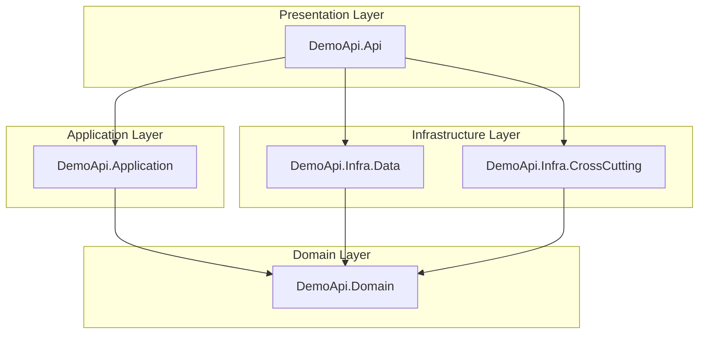

# Demo API - Architecture Documentation

[](https://dotnet.microsoft.com/)
[](https://docs.microsoft.com/en-us/dotnet/csharp/)
[](LICENSE)
[]()

A demonstration RESTful API built with **.NET 8** showcasing enterprise-grade software architecture patterns, clean code principles, and industry best practices. This project serves as a reference implementation for building scalable, maintainable, and testable Web APIs.

---

## 📋 Table of Contents

- [Architecture Overview](#architecture-overview)
- [Project Structure](#project-structure)
- [Design Patterns & Principles](#design-patterns--principles)
- [Layer Responsibilities](#layer-responsibilities)
- [Testing Strategy](#testing-strategy)
- [Technologies & Libraries](#technologies--libraries)
- [Getting Started](#getting-started)
- [API Documentation](#api-documentation)

---

## 🏗️ Architecture Overview

This project implements a **Clean Architecture** (also known as Onion Architecture), enforcing a strict separation of concerns where the **Domain** is the heart of the software.

### Dependency Inversion Principle (DIP)

A key characteristic of this architecture is the application of the **Dependency Inversion Principle**. 
- The **Domain Layer** defines the contracts (Interfaces) for data persistence and other external services.
- The **Infrastructure Layer** depends on the Domain and implements these interfaces.
- The **Application Layer** depends only on the Domain and abstractions, never on concrete infrastructure details.

This ensures that the core business logic remains agnostic to external technologies (like databases or APIs), making the system highly testable and adaptable.

### Architectural Diagram



*Note: The API references Infrastructure only for Dependency Injection (Composition Root).*

---

## 🎨 Design Patterns & Principles

### SOLID Principles
The project strictly adheres to SOLID principles, ensuring code is easy to maintain and extend.
- **SRP**: Classes have a single responsibility (e.g., `ProductAppService` orchestrates, `ProductRepository` persists).
- **OCP**: The system is open for extension (e.g., adding new repositories) but closed for modification.
- **DIP**: High-level modules (Application) do not depend on low-level modules (Infrastructure); both depend on abstractions (Domain Interfaces).

### Key Patterns Implemented

#### 1. **Repository Pattern**
Abstacts the data access logic. The domain defines `IProductRepository`, and the infrastructure implements it.
*Current implementation uses an In-Memory storage for demonstration purposes, but can be easily swapped for Entity Framework Core or Dapper without changing a single line of business logic.*

#### 2. **Notification Pattern (Domain Notifications)**
Instead of throwing exceptions for business validation errors (which is costly and breaks control flow), the project uses a `NotificatorHandler`.
- Errors are accumulated during the request.
- The controller checks for notifications before returning a response.
- Result: Consistent HTTP 400/422 responses with a standard error format.

#### 3. **Service Layer**
The `ProductAppService` acts as a facade for the domain. It orchestrates the flow:
1. Receives DTOs.
2. Maps to Domain Entities.
3. Validates business rules.
4. Calls Repositories.
5. Returns DTOs.

#### 4. **DTOs (Data Transfer Objects)**
`ProductViewModel` is used to decouple the internal Domain Entities from the external API contract. This allows the domain model to evolve independently of the API.

---

## 📁 Project Structure

```text
src/
├── DemoApi.Api/                    # Presentation Layer (Web API)
│   ├── Configuration/              # DI, Swagger, AutoMapper setup
│   ├── Controllers/                # API Endpoints
│   └── Program.cs                  # Composition Root
│
├── DemoApi.Application/            # Application Layer
│   ├── Services/                   # Business orchestration
│   ├── Models/                     # ViewModels/DTOs
│   └── Automapper/                 # Mapping profiles
│
├── DemoApi.Domain/                 # Domain Layer (Core)
│   ├── Entities/                   # Business Objects
│   ├── Interfaces/                 # Repository & Service Contracts
│   └── Handlers/                   # Notification Handler
│
├── DemoApi.Infra.Data/             # Infrastructure Layer
│   └── Repositories/               # Data access implementation
│
└── DemoApi.Infra.CrossCutting/     # Cross-Cutting Concerns
    └── Logging/                    # Logger implementation

tests/
├── DemoApi.Api.Test/               # Integration Tests
│   └── Factories/                  # WebApplicationFactory setup
│
└── DemoApi.Application.Test/       # Unit Tests
    └── Products/                   # Service logic tests
```

---

## 🧪 Testing Strategy

The project employs a comprehensive testing strategy ensuring reliability at all levels.

### 1. Unit Tests (`DemoApi.Application.Test`)
Focus on the **Application Layer** and **Business Rules**.
- **Tools**: xUnit, Moq, FluentAssertions, Bogus.
- **Strategy**: All external dependencies (Repositories, Notificator) are mocked. We test the logic in isolation (e.g., "Should return error if product name is empty").

### 2. Integration Tests (`DemoApi.Api.Test`)
Focus on the **API Endpoints** and the full request lifecycle.
- **Tools**: Microsoft.AspNetCore.Mvc.Testing (`WebApplicationFactory`).
- **Strategy**: Spins up an in-memory test server. Real HTTP requests are sent to the API to verify status codes, response bodies, and correct wiring of the dependency injection container.

---

## 🛠️ Technologies & Libraries

*   **Core**: [.NET 8](https://dotnet.microsoft.com/), C# 12
*   **Web API**: ASP.NET Core
*   **Mapping**: [AutoMapper](https://automapper.org/)
*   **Logging**: [NLog](https://nlog-project.org/)
*   **Documentation**: [Swagger / OpenAPI](https://swagger.io/)
*   **Testing**:
    *   [xUnit](https://xunit.net/)
    *   [Moq](https://github.com/moq/moq4)
    *   [FluentAssertions](https://fluentassertions.com/)
    *   [Bogus](https://github.com/bchavez/Bogus) (Fake data generation)

---

## 🚀 Getting Started

### Prerequisites
- [.NET 8 SDK](https://dotnet.microsoft.com/download/dotnet/8.0)

### Installation

1. **Clone the repository**
   ```bash
   git clone https://github.com/lucasbarbosa/Demo-Api.git
   cd Demo-Api
   ```

2. **Restore dependencies**
   ```bash
   dotnet restore
   ```

3. **Run the Application**
   ```bash
   dotnet run --project src/DemoApi.Api
   ```
   The API will start at `https://localhost:5001` (or similar, check console output).

4. **Run Tests**
   ```bash
   dotnet test
   ```

---

## 📖 API Documentation

The API is fully documented using Swagger/OpenAPI.

1. Run the application.
2. Navigate to: **`https://localhost:7167/swagger`** (port may vary).

### Example Request (Create Product)

**POST** `/api/v1/products`

```json
{
  "name": "Premium Widget",
  "weight": 1.5
}
```

**Response (201 Created)**

```json
{
  "success": true,
  "data": {
    "id": 1,
    "name": "Premium Widget",
    "weight": 1.5
  },
  "errors": []
}
```
