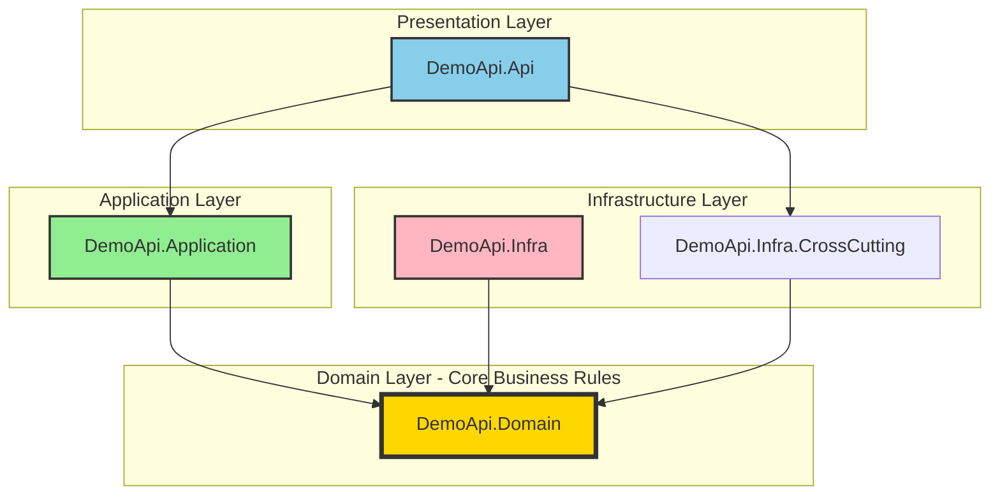

# Demo API - .NET 8 Architecture Showcase

[](https://dotnet.microsoft.com/)
[](https://docs.microsoft.com/en-us/dotnet/csharp/)
[](https://www.docker.com/)
[](https://jwt.io/)
[](LICENSE)
[]()
[]()
[]()

> A comprehensive demonstration of **enterprise-grade .NET 8 RESTful API** development, showcasing three progressive versions with Clean Architecture, JWT authentication, FluentValidation, and Docker containerization. This repository serves as a reference implementation for building scalable, maintainable, and secure Web APIs suitable for production environments.

---

## 🎯 Project Versions

This repository contains **three progressive versions** of the same API, each building upon the previous with additional enterprise features:

<table>
<thead>
<tr>
<th width="20%">Version</th>
<th width="25%">Directory</th>
<th width="55%">Key Features</th>
</tr>
</thead>
<tbody>
<tr>
<td><strong>V1: Foundation</strong><br/><sub>Clean Architecture</sub></td>
<td><code>net8_0/swagger/</code></td>
<td>
✅ Clean Architecture (DDD)<br/>
✅ Swagger/OpenAPI<br/>
✅ API Versioning<br/>
✅ Repository Pattern<br/>
✅ Dependency Injection<br/>
✅ 53 Unit & Integration Tests
</td>
</tr>
<tr>
<td><strong>V2: Security</strong><br/><sub>JWT + Validation</sub></td>
<td><code>net8_0/swagger-jwt/</code></td>
<td>
<strong>All V1 features +</strong><br/>
✅ JWT Authentication (HMAC-SHA256)<br/>
✅ FluentValidation (input sanitization)<br/>
✅ Strong Typing (nullable reference types)<br/>
✅ OWASP Top 10 mitigations<br/>
✅ Exception Handling Middleware<br/>
✅ NLog Structured Logging<br/>
✅ 115+ Tests (85% coverage)
</td>
</tr>
<tr>
<td><strong>V3: Containerization</strong><br/><sub>Production-Ready</sub></td>
<td><code>net8_0/swagger-jwt-docker/</code></td>
<td>
<strong>All V2 features +</strong><br/>
✅ Docker Multi-Stage Build<br/>
✅ Docker Compose Orchestration<br/>
✅ Non-Root User Execution (security)<br/>
✅ Optimized Image (~210MB)<br/>
✅ Environment-Based Config<br/>
✅ Azure/AWS Deployment Ready
</td>
</tr>
</tbody>
</table>

---

## 📊 Feature Comparison Matrix

| Feature | V1 (Swagger) | V2 (JWT) | V3 (Docker) |
|---------|:------------:|:--------:|:-----------:|
| **Clean Architecture** | ✅ | ✅ | ✅ |
| **Swagger Documentation** | ✅ | ✅ | ✅ |
| **API Versioning** | ✅ | ✅ | ✅ |
| **Repository Pattern** | ✅ | ✅ | ✅ |
| **Unit Tests** | ✅ (53) | ✅ (115+) | ✅ (115+) |
| **Integration Tests** | ✅ | ✅ | ✅ |
| **JWT Authentication** | ❌ | ✅ | ✅ |
| **FluentValidation** | ❌ | ✅ | ✅ |
| **OWASP Security** | ❌ | ✅ | ✅ |
| **Strong Typing** | ❌ | ✅ | ✅ |
| **Structured Logging** | ❌ | ✅ | ✅ |
| **Docker Support** | ❌ | ❌ | ✅ |
| **Multi-Stage Build** | ❌ | ❌ | ✅ |
| **Non-Root Container** | ❌ | ❌ | ✅ |
| **Docker Compose** | ❌ | ❌ | ✅ |
| **Test Coverage** | ~85% | ~85% | ~85% |

---

## 🚀 Quick Start Guide

### Version 1: Foundation (Clean Architecture)

```bash
cd net8_0/swagger
dotnet restore
dotnet run --project src/DemoApi.Api

# Access Swagger
# https://localhost:5001/swagger
```

**Use Case**: Learning Clean Architecture fundamentals, API design patterns, and testing strategies.

### Version 2: Security (JWT + FluentValidation)

```bash
cd net8_0/swagger-jwt
dotnet restore
dotnet run --project src/DemoApi.Api

# Generate JWT Token
curl -X POST http://localhost:5001/api/v1/auth/token \
  -H "X-Security-Key: your-32-character-minimum-secret-key"

# Use token in requests
curl http://localhost:5001/api/v1/products \
  -H "Authorization: Bearer {token}"
```

**Use Case**: Implementing authentication/authorization, input validation, and security best practices.

### Version 3: Production-Ready (Docker)

```bash
cd net8_0/swagger-jwt-docker/docker
docker-compose up --build

# Access API on port 5200
curl http://localhost:5200/swagger

# Generate token
curl -X POST http://localhost:5200/api/v1/auth/token \
  -H "X-Security-Key: dev-only-key-minimum-32-characters-xyz123"
```

**Use Case**: Container orchestration, production deployment, and DevOps workflows.

---

## 🏗️ Architecture Overview

This project implements a **Clean Architecture** (also known as Onion Architecture), enforcing a strict separation of concerns where the **Domain** is the heart of the software.

### Dependency Inversion Principle (DIP)

A key characteristic of this architecture is the application of the **Dependency Inversion Principle**:
- The **Domain Layer** defines the contracts (Interfaces) for data persistence and other external services.
- The **Infrastructure Layer** depends on the Domain and implements these interfaces.
- The **Application Layer** depends only on the Domain and abstractions, never on concrete infrastructure details.

This ensures that the core business logic remains agnostic to external technologies (like databases or APIs), making the system highly testable and adaptable.

### Architectural Diagram



---

## 📁 Project Structure

```
demo-api/
├── net8_0/
│   ├── swagger/                          # V1: Clean Architecture Foundation
│   │   ├── src/
│   │   │   ├── DemoApi.Api/             # Presentation Layer (Controllers)
│   │   │   ├── DemoApi.Application/     # Application Layer (Use Cases)
│   │   │   ├── DemoApi.Domain/          # Domain Layer (Entities, Interfaces)
│   │   │   ├── DemoApi.Infra/           # Infrastructure (Repositories)
│   │   │   └── DemoApi.Infra.CrossCutting/  # DI, Logging
│   │   └── tests/
│   │       ├── DemoApi.Api.Test/        # Integration Tests
│   │       └── DemoApi.Application.Test/  # Unit Tests
│   │
│   ├── swagger-jwt/                      # V2: + JWT + FluentValidation
│   │   ├── src/
│   │   │   └── (same structure as V1)
│   │   ├── tests/
│   │   └── docs/
│   │       ├── JWT_AUTHENTICATION.md    # JWT implementation details
│   │       └── SECURITY_BEST_PRACTICES.md
│   │
│   └── swagger-jwt-docker/              # V3: + Docker Containerization
│       ├── src/
│       ├── tests/
│       ├── docker/
│       │   ├── Dockerfile               # Multi-stage build
│       │   ├── docker-compose.yml       # Orchestration
│       │   └── .dockerignore
│       └── README.md                    # Docker-specific docs
│
└── README.md                            # This file
```

---

## 🔐 Security Features (V2 & V3)

### JWT Authentication
- **Algorithm**: HMAC-SHA256 (HS256)
- **Key Strength**: Minimum 32 characters (256-bit)
- **Token Expiration**: 60 minutes (configurable)
- **Validation**: Issuer, Audience, Signature, Lifetime checks
- **Zero Clock Skew**: Strict expiration enforcement

### OWASP Top 10 Mitigations
| Threat | Mitigation |
|--------|------------|
| **A01: Broken Access Control** | JWT authentication + `[Authorize]` attributes |
| **A02: Cryptographic Failures** | HS256 signing, 256-bit keys, HTTPS enforcement |
| **A03: Injection** | FluentValidation input sanitization, EF Core parameterization |
| **A04: Insecure Design** | Fail-fast validation, defensive programming |
| **A05: Security Misconfiguration** | Environment-specific configs, no stack traces in prod |
| **A07: Authentication Failures** | JWT with strict expiration, rate limiting ready |
| **A08: Data Integrity Failures** | Signed JWTs, signature validation |
| **A09: Logging Failures** | NLog structured logging, sanitized errors |

---

## 🧪 Testing Strategy

### Test Coverage by Version

| Version | Unit Tests | Integration Tests | Total Tests | Coverage |
|---------|:----------:|:-----------------:|:-----------:|:--------:|
| **V1** | 22 | 31 | 53 | ~85% |
| **V2** | 56+ | 59+ | 115+ | ~85% |
| **V3** | 56+ | 59+ | 115+ | ~85% |

### Test Pyramid

```
        ┌─────────────┐
        │ Integration │  (31-59 tests)
        │   Tests     │  - API endpoints
        │             │  - Full pipeline
        ├─────────────┤
        │    Unit     │  (22-56 tests)
        │   Tests     │  - Services
        │             │  - Validators
        │             │  - Repositories
        └─────────────┘
```

### Technologies Used
- **xUnit** - Test framework
- **Moq** - Mocking framework
- **FluentAssertions** - Assertion library
- **Bogus** - Fake data generation
- **Microsoft.AspNetCore.Mvc.Testing** - Integration test host

---

## 🛠️ Technologies & Libraries

### Core Framework
| Technology | Version | Purpose |
|------------|---------|---------|
| **.NET** | 8.0 | Runtime framework |
| **C#** | 12.0 | Programming language |
| **ASP.NET Core** | 8.0 | Web framework |

### Architecture & Patterns
| Library | Version | Purpose |
|---------|---------|---------|
| **AutoMapper** | 12.0.1 | Object-to-object mapping |
| **FluentValidation** (V2+) | 11.3.1 | Input validation |
| **Swashbuckle** | 6.6.2 | Swagger/OpenAPI |

### Authentication (V2+)
| Library | Version | Purpose |
|---------|---------|---------|
| **Microsoft.AspNetCore.Authentication.JwtBearer** | 8.0.* | JWT authentication |
| **System.IdentityModel.Tokens.Jwt** | Latest | JWT token handling |

### Logging (V2+)
| Library | Version | Purpose |
|---------|---------|---------|
| **NLog.Web.AspNetCore** | 6.1.0 | Structured logging |

### Containerization (V3)
| Technology | Version | Purpose |
|------------|---------|---------|
| **Docker** | ≥20.10 | Containerization |
| **Docker Compose** | ≥2.0 | Orchestration |

---

## 📡 API Endpoints

### Products API (`/api/v1/products`)

| Method | Endpoint | Description | Auth Required | Success Response |
|--------|----------|-------------|:-------------:|------------------|
| `GET` | `/api/v1/products` | Get all products | No (V1) / Yes (V2+) | `200 OK` - `ProductListResponse` |
| `GET` | `/api/v1/products/{id}` | Get product by ID | No (V1) / Yes (V2+) | `200 OK` - `ProductResponse` |
| `POST` | `/api/v1/products` | Create new product | No (V1) / Yes (V2+) | `201 Created` - `ProductResponse` |
| `PUT` | `/api/v1/products` | Update product | No (V1) / Yes (V2+) | `204 No Content` |
| `DELETE` | `/api/v1/products/{id}` | Delete product | No (V1) / Yes (V2+) | `204 No Content` |

### Authentication API (V2 & V3 only)

| Method | Endpoint | Description | Success Response |
|--------|----------|-------------|------------------|
| `POST` | `/api/v1/auth/token` | Generate JWT token | `200 OK` - `TokenViewModel` |

**Example Token Request**:
```bash
curl -X POST http://localhost:5001/api/v1/auth/token \
  -H "X-Security-Key: your-32-character-minimum-secret-key"
```

**Example Response**:
```json
{
  "success": true,
  "data": {
    "accessToken": "eyJhbGciOiJIUzI1NiIsInR5cCI6IkpXVCJ9...",
    "tokenType": "Bearer",
    "expiresIn": 3600,
    "created": "2024-01-15T10:00:00Z",
    "expires": "2024-01-15T11:00:00Z"
  }
}
```

---

## 🐳 Docker Features (V3)

### Multi-Stage Build Optimization

```dockerfile
# Stage 1: Build (SDK 8.0 - ~1.2GB)
FROM mcr.microsoft.com/dotnet/sdk:8.0 AS build
COPY . .
RUN dotnet restore && dotnet publish

# Stage 2: Runtime (ASP.NET 8.0 - ~210MB)
FROM mcr.microsoft.com/dotnet/aspnet:8.0 AS final
USER app  # Non-root execution for security
COPY --from=build /app/publish .
ENTRYPOINT ["dotnet", "DemoApi.Api.dll"]
```

### Benefits
- ✅ **80% smaller image** (210MB vs 1.2GB)
- ✅ **Faster deployments** (less data transfer)
- ✅ **Enhanced security** (no build tools in runtime image)
- ✅ **Non-root user** (reduced attack surface)
- ✅ **Layer caching** (faster rebuilds)

### Docker Commands

```bash
# Build image
docker build -f docker/Dockerfile -t demoapi:latest .

# Run with Docker Compose
cd docker && docker-compose up --build

# Run standalone container
docker run -d -p 5200:8080 \
  -e Authorization__SecurityKey=your-key \
  --name demoapi demoapi:latest
```

---

## 📊 Project Metrics

| Metric | Value |
|--------|-------|
| **Total Lines of Code** | ~2,500+ |
| **Test Coverage** | ~85% |
| **Total Tests** | 115+ (All Passing ✅) |
| **API Endpoints** | 6 (5 CRUD + 1 Auth) |
| **Supported Versions** | 3 progressive implementations |
| **Docker Image Size** | 210MB (optimized) |
| **Build Time** | ~45s (Docker), ~30s (native) |

### Quality Indicators

- ✅ **100% Build Success Rate**
- ✅ **0 Known Bugs**
- ✅ **SOLID Principles Applied**
- ✅ **Clean Architecture Implementation**
- ✅ **Comprehensive Documentation**
- ✅ **Production-Ready Code Quality**
- ✅ **OWASP Security Standards**
- ✅ **Container Security (CIS Benchmark 4.1)**

---

## 📚 Additional Documentation

### Version-Specific Documentation

| Version | Documentation |
|---------|---------------|
| **V1** | See `net8_0/swagger/` directory (foundation docs in this README) |
| **V2** | [`net8_0/swagger-jwt/docs/`](net8_0/swagger-jwt/docs/) - JWT & Security guides |
| **V3** | [`net8_0/swagger-jwt-docker/README.md`](net8_0/swagger-jwt-docker/README.md) - Docker deployment |

### Deep Dive Guides (V2+)

- [**JWT Authentication Strategy**](net8_0/swagger-jwt/docs/JWT_AUTHENTICATION.md) - Token generation, validation, security measures
- [**Security Best Practices**](net8_0/swagger-jwt/docs/SECURITY_BEST_PRACTICES.md) - OWASP Top 10 mitigations, threat matrix

---

## 🎓 Learning Objectives

This repository is designed to demonstrate:

### For Junior Developers
- ✅ Clean Architecture fundamentals (V1)
- ✅ Repository Pattern & Dependency Injection
- ✅ Unit & Integration Testing strategies
- ✅ API design best practices

### For Mid-Level Developers
- ✅ JWT authentication implementation (V2)
- ✅ FluentValidation for input sanitization
- ✅ Security best practices (OWASP Top 10)
- ✅ Strong typing & nullable reference types

### For Senior Developers
- ✅ Docker containerization strategies (V3)
- ✅ Multi-stage build optimization
- ✅ Production deployment patterns
- ✅ Security hardening (non-root containers)

---

## 🚀 Production Deployment

### Version 3 is production-ready with:

**Azure Container Apps**:
```bash
az containerapp create \
  --name demoapi \
  --resource-group myResourceGroup \
  --image demoapi:latest \
  --target-port 8080 \
  --env-vars Authorization__SecurityKey=secretref:jwt-key
```

**AWS ECS/Fargate**:
```bash
aws ecs create-service \
  --cluster demo-cluster \
  --service-name demoapi \
  --task-definition demoapi:1 \
  --desired-count 2
```

**Kubernetes**:
```yaml
apiVersion: apps/v1
kind: Deployment
metadata:
  name: demoapi
spec:
  replicas: 3
  template:
    spec:
      containers:
      - name: demoapi
        image: demoapi:latest
        ports:
        - containerPort: 8080
        env:
        - name: Authorization__SecurityKey
          valueFrom:
            secretKeyRef:
              name: jwt-secret
              key: security-key
```

---

## 🤝 Contributing

This project is a demonstration of best practices and serves as a reference implementation. Feel free to:
- 🌟 Star this repository if you find it useful
- 🍴 Fork it for your own projects
- 📖 Use it as a learning resource
- 💬 Open issues for questions or suggestions

---

## 📄 License

This project is licensed under the MIT License - see the LICENSE file for details.

---

## 👨‍💻 Author

**Lucas Barbosa**

- GitHub: [@lucasbarbosa](https://github.com/lucasbarbosa)
- Repository: [demo-api](https://github.com/lucasbarbosa/demo-api)

---

## 🏆 Use Cases

### For Technical Interviews
- ✅ Demonstrates Clean Architecture mastery
- ✅ Shows security-first mindset (JWT, OWASP)
- ✅ Proves DevOps skills (Docker, containerization)
- ✅ Exhibits testing expertise (115+ tests, 85% coverage)

### For Learning
- ✅ Progressive complexity (3 versions)
- ✅ Comprehensive documentation
- ✅ Real-world patterns & practices
- ✅ Production-ready code quality

### For Portfolio
- ✅ Enterprise-grade architecture
- ✅ Multiple technology demonstrations
- ✅ Professional documentation
- ✅ Deployment-ready solutions

---

*This README demonstrates technical documentation best practices for enterprise-grade .NET applications, suitable for showcasing in technical interviews, portfolio presentations, and as a learning resource for software engineering teams.*
