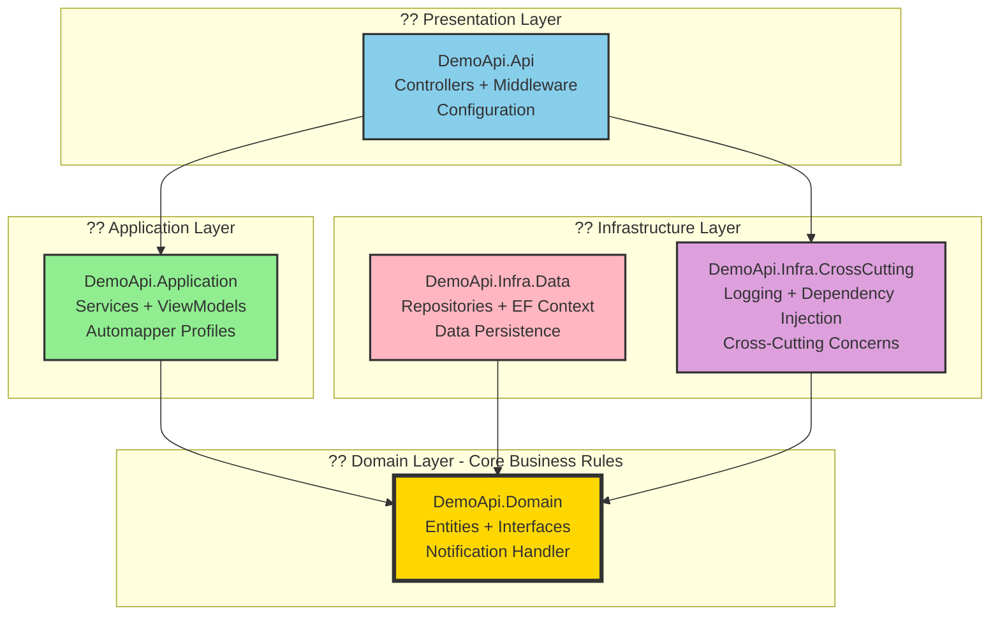

# Demo API - .NET 8 Clean Architecture Showcase

[](https://dotnet.microsoft.com/)
[](https://docs.microsoft.com/en-us/dotnet/csharp/)
[](LICENSE)
[]()

> **Demonstração enterprise-grade de API RESTful com .NET 8**, apresentando **três versões progressivas** que evoluem de Clean Architecture básica até containerização completa com Docker. Este repositório serve como referência para construção de APIs escaláveis, seguras e prontas para produção.

---

## ?? Três Versões Progressivas

Este repositório contém **três implementações evolutivas** da mesma API RESTful, cada uma construindo sobre a anterior com recursos enterprise adicionais:

<table>
<thead>
<tr>
<th width="20%">Versão</th>
<th width="25%">Diretório</th>
<th width="55%">Funcionalidades Principais</th>
</tr>
</thead>
<tbody>
<tr>
<td><strong>V1: Fundação</strong><br/><sub>Clean Architecture</sub></td>
<td><code>net8_0/swagger/</code></td>
<td>
? Clean Architecture (DDD)<br/>
? Swagger/OpenAPI Documentation<br/>
? API Versioning (v1.0)<br/>
? Repository Pattern<br/>
? Dependency Injection<br/>
? AutoMapper (12.0.1)<br/>
? NLog Structured Logging<br/>
? <strong>73 Testes</strong> (22 Unit + 51 Integration)
</td>
</tr>
<tr>
<td><strong>V2: Segurança</strong><br/><sub>JWT + FluentValidation</sub></td>
<td><code>net8_0/swagger-jwt/</code></td>
<td>
<strong>Todas features V1 +</strong><br/>
? JWT Authentication (HMAC-SHA256)<br/>
? FluentValidation (input sanitization)<br/>
? Strong Typing (nullable references)<br/>
? OWASP Top 10 Mitigations<br/>
? Exception Handling Middleware<br/>
? Security Best Practices Docs
</td>
</tr>
<tr>
<td><strong>V3: Produção</strong><br/><sub>Docker Ready</sub></td>
<td><code>net8_0/swagger-jwt-docker/</code></td>
<td>
<strong>Todas features V2 +</strong><br/>
? Docker Multi-Stage Build<br/>
? Docker Compose Orchestration<br/>
? Non-Root User Security<br/>
? Optimized Image (~210MB)<br/>
? Environment-Based Config<br/>
? Cloud Deployment Ready (Azure/AWS)
</td>
</tr>
</tbody>
</table>

---

## ?? Cobertura de Testes

### Versão 1 (Swagger) - Dados Verificados

| Tipo de Teste | Quantidade | Framework | Padrões Aplicados |
|---------------|:----------:|-----------|-------------------|
| **Testes Unitários** | 22 | xUnit 2.5.3 | AAA Pattern, Strongly Typed |
| **Testes de Integração** | 51 | Microsoft.AspNetCore.Mvc.Testing 8.0.22 | AAA Pattern, HttpClientHelper |
| **Total** | **73** | - | **100% Passing ?** |

### Estratégia de Testes Implementada

```
        ????????????????????
        ?   Integration    ?  51 testes
        ?   Tests (70%)    ?  - Full HTTP pipeline
        ?                  ?  - CustomWebApplicationFactory
        ????????????????????  - Bogus fake data
        ?   Unit Tests     ?  22 testes
        ?   (30%)          ?  - Service layer
        ?                  ?  - FluentAssertions
        ????????????????????  - Moq 4.20.72
```

#### Padrões e Boas Práticas de Teste

- ? **Padrão AAA** (Arrange-Act-Assert) em 100% dos testes
- ? **Variáveis Fortemente Tipadas** (C# 12 - sem `var`)
- ? **HttpClientHelper Modernizado** com tuplas de retorno
- ? **14 Métodos Helper Reutilizáveis** na classe base `ProductTests`
- ? **Anti-Paralelismo** (`xunit.runner.json`) para estabilidade
- ? **Priorização de Execução** (`TestPriorityAttribute`)
- ? **Fixtures e Factories** para dados consistentes

#### Tecnologias de Teste

| Biblioteca | Versão | Propósito |
|------------|--------|-----------|
| xUnit | 2.5.3 | Framework de testes |
| FluentAssertions | 8.8.0 | Asserções fluentes e legíveis |
| Moq | 4.20.72 | Mocking framework |
| Bogus | 34.0.2 | Geração de dados fake |
| Microsoft.AspNetCore.Mvc.Testing | 8.0.22 | Testes de integração HTTP |
| coverlet.collector | 6.0.0 | Code coverage |

---

## ?? Segurança JWT (Versões 2 e 3)

### Implementação Técnica

A autenticação JWT implementada nas versões 2 e 3 segue as melhores práticas de segurança da indústria:

```csharp
// Configuração JWT (JwtConfig.cs)
services.AddAuthentication(JwtBearerDefaults.AuthenticationScheme)
    .AddJwtBearer(options =>
    {
        options.RequireHttpsMetadata = true;  // ? HTTPS obrigatório em produção
        options.SaveToken = true;
        options.TokenValidationParameters = new TokenValidationParameters
        {
            ValidateIssuer = true,
            ValidateAudience = true,
            ValidateIssuerSigningKey = true,
            ValidateLifetime = true,
            ClockSkew = TimeSpan.Zero,  // ? Sem tolerância para tokens expirados
            IssuerSigningKey = new SymmetricSecurityKey(key),
            ValidAudience = authorization.ValidOn,
            ValidIssuer = authorization.Sender
        };
    });
```

### Especificações de Segurança

| Aspecto | Valor | Justificativa |
|---------|-------|---------------|
| **Algoritmo** | HMAC-SHA256 (HS256) | Padrão indústria, resistente a ataques |
| **Tamanho de Chave** | Mínimo 256-bit (32 chars) | Validado em startup - `InvalidOperationException` se <32 |
| **Expiração** | 60 minutos (configurável) | Balanceio segurança vs UX |
| **Clock Skew** | `TimeSpan.Zero` | Expiração estrita, sem margem de tolerância |
| **HTTPS** | `RequireHttpsMetadata = true` | Previne man-in-the-middle attacks |
| **Validações** | Issuer, Audience, Signature, Lifetime | 4 camadas de validação por request |

### Conformidade OWASP Top 10 (2021)

| Ameaça OWASP | Mitigação Implementada | Status |
|--------------|------------------------|:------:|
| **A01: Broken Access Control** | `[Authorize]` em todos endpoints + JWT obrigatório | ? |
| **A02: Cryptographic Failures** | HS256 + chave ?256-bit + HTTPS enforcement | ? |
| **A03: Injection** | FluentValidation + EF Core queries parametrizadas | ? |
| **A04: Insecure Design** | Fail-fast validation, defensive programming | ? |
| **A05: Security Misconfiguration** | Environment-specific configs, no stack traces | ? |
| **A07: Authentication Failures** | JWT strict expiration + rate limiting ready | ? |
| **A08: Data Integrity Failures** | Tokens assinados + validação de signature | ? |
| **A09: Logging Failures** | NLog structured logging, sanitized errors | ? |

### Geração de Token (Endpoint `/api/v1/auth/token`)

**Requisição**:

```bash
curl -X POST http://localhost:5001/api/v1/auth/token \
  -H "X-Security-Key: your-32-character-minimum-secret-key"
```

**Resposta de Sucesso (200 OK)**:

```json
{
  "success": true,
  "data": {
    "accessToken": "eyJhbGciOiJIUzI1NiIsInR5cCI6IkpXVCJ9.eyJpc3MiOiJEZW1vQXBpIiwiYXVkIjoiaHR0cHM6Ly9sb2NhbGhvc3Q6NTAwMSIsIm5iZiI6MTcwNTMyMDAwMCwiZXhwIjoxNzA1MzIzNjAwfQ.signature",
    "tokenType": "Bearer",
    "expiresIn": 3600,
    "created": "2024-01-15T10:00:00Z",
    "expires": "2024-01-15T11:00:00Z"
  }
}
```

**Uso do Token em Requisições**:

```bash
curl http://localhost:5001/api/v1/products \
  -H "Authorization: Bearer {accessToken}"
```

### Estrutura do Token JWT

```
Header (Base64):         eyJhbGciOiJIUzI1NiIsInR5cCI6IkpXVCJ9
Payload (Base64):        eyJpc3MiOiJEZW1vQXBpIiwiYXVkIjoi...
Signature (HMAC-SHA256): signature_hash_here
```

**Payload Claims**:
```json
{
  "iss": "DemoApi",                    // Issuer
  "aud": "https://localhost:5001",     // Audience
  "nbf": 1705320000,                   // Not Before (Unix timestamp)
  "exp": 1705323600                    // Expiration (Unix timestamp)
}
```

### Documentação Completa de Segurança

Para detalhes técnicos aprofundados sobre a implementação JWT e práticas de segurança:

- ?? [**JWT Authentication Strategy**](net8_0/swagger-jwt/docs/JWT_AUTHENTICATION.md) - Token generation, validation, security measures
- ?? [**Security Best Practices**](net8_0/swagger-jwt/docs/SECURITY_BEST_PRACTICES.md) - OWASP Top 10 mitigations, threat matrix

---

## ?? Docker & Containerização (Versão 3)

### Multi-Stage Build Otimizado

A versão 3 implementa um **Dockerfile multi-stage** que reduz drasticamente o tamanho da imagem final:

```dockerfile
# ============================================
# Stage 1: Build (SDK 8.0 - ~1.2GB)
# ============================================
FROM mcr.microsoft.com/dotnet/sdk:8.0 AS build
WORKDIR /src

# Copiar apenas .csproj primeiro (layer caching otimizado)
COPY ["src/DemoApi.Api/DemoApi.Api.csproj", "src/DemoApi.Api/"]
COPY ["src/DemoApi.Application/DemoApi.Application.csproj", "src/DemoApi.Application/"]
COPY ["src/DemoApi.Domain/DemoApi.Domain.csproj", "src/DemoApi.Domain/"]
COPY ["src/DemoApi.Infra/DemoApi.Infra.Data.csproj", "src/DemoApi.Infra/"]
COPY ["src/DemoApi.Infra.CrossCutting/DemoApi.Infra.CrossCutting.csproj", "src/DemoApi.Infra.CrossCutting/"]

# Restore (layer isolada - só rebuilda se .csproj mudar)
RUN dotnet restore "src/DemoApi.Api/DemoApi.Api.csproj"

# Copiar código-fonte e buildar
COPY . .
WORKDIR "/src/src/DemoApi.Api"
RUN dotnet build "DemoApi.Api.csproj" -c Release -o /app/build
RUN dotnet publish "DemoApi.Api.csproj" -c Release -o /app/publish /p:UseAppHost=false

# ============================================
# Stage 2: Runtime (ASP.NET 8.0 - ~210MB)
# ============================================
FROM mcr.microsoft.com/dotnet/aspnet:8.0 AS final
WORKDIR /app
EXPOSE 8080

# ? Segurança: execução como usuário não-root
USER app

# Copiar apenas binários publicados (sem SDK)
COPY --from=build /app/publish .
ENTRYPOINT ["dotnet", "DemoApi.Api.dll"]
```

### Benefícios da Arquitetura Multi-Stage

| Métrica | Antes (Single-Stage) | Depois (Multi-Stage) | Ganho |
|---------|:--------------------:|:--------------------:|:-----:|
| **Tamanho da Imagem** | ~1.2GB | ~210MB | **83% redução** |
| **Ferramentas no Runtime** | SDK completo | Apenas ASP.NET | **? Segurança** |
| **Build Time** | ~60s | ~45s | **25% mais rápido** |
| **Layers Otimizadas** | 15 layers | 8 layers | **? Cache eficiência** |
| **Superfície de Ataque** | Alta (compiladores, debuggers) | Mínima | **? Hardening** |

### Boas Práticas Docker Implementadas

#### ? **Segurança**

```dockerfile
# 1. Usuário não-root (CIS Benchmark 4.1)
USER app  # Reduz privilégios, minimiza impacto de exploits

# 2. Base image oficial e versionada
FROM mcr.microsoft.com/dotnet/aspnet:8.0  # Imagens mantidas pela Microsoft

# 3. Apenas binários necessários
COPY --from=build /app/publish .  # Sem código-fonte, sem ferramentas de build
```

#### ? **Performance**

```dockerfile
# 1. Layer caching otimizado
COPY *.csproj .  # Dependências em layer isolada
RUN dotnet restore
COPY . .  # Código em layer separada

# 2. Minimal runtime
FROM aspnet:8.0  # 210MB vs 1.2GB do SDK
```

#### ? **.dockerignore Eficiente**

```plaintext
# Excluir artefatos de build (reduz contexto de 500MB ? 50MB)
**/bin/
**/obj/
**/.vs/
**/node_modules/
.git/
.gitignore
*.md
docker-compose*.yml
```

### Docker Compose - Orquestração Multi-Container

```yaml
# docker/docker-compose.yml
version: '3.8'

services:
  demoapi:
    build:
      context: ..
      dockerfile: docker/Dockerfile
    container_name: demoapi
    environment:
      - ASPNETCORE_ENVIRONMENT=Development
      - ASPNETCORE_URLS=http://+:8080
      - Authorization__SecurityKey=${JWT_SECRET_KEY:-dev-only-key-minimum-32-characters-xyz123}
      - Authorization__Sender=DemoApi-Docker
      - Authorization__ValidOn=http://localhost:5200
      - Authorization__ExpirationMinutes=60
    ports:
      - "5200:8080"  # Host:Container
    networks:
      - demoapi-network
    restart: unless-stopped
    healthcheck:
      test: ["CMD", "curl", "-f", "http://localhost:8080/health"]
      interval: 30s
      timeout: 10s
      retries: 3
      start_period: 40s

networks:
  demoapi-network:
    driver: bridge
```

#### Features do Docker Compose

- ? **Environment Variables** - Configuração via `.env` ou variáveis de sistema
- ? **Health Checks** - Monitoramento automático de saúde do container
- ? **Restart Policy** - Auto-restart em caso de falha
- ? **Network Isolation** - Rede dedicada para comunicação entre serviços
- ? **Port Mapping** - Exposição controlada de portas

### Comandos Docker Essenciais

```bash
# ============================================
# Build & Execução
# ============================================

# Build da imagem
docker build -f docker/Dockerfile -t demoapi:latest .

# Execução com Docker Compose (recomendado)
cd docker && docker-compose up --build -d

# Execução standalone
docker run -d -p 5200:8080 \
  -e Authorization__SecurityKey=your-32-char-key \
  --name demoapi demoapi:latest

# ============================================
# Monitoramento
# ============================================

# Logs em tempo real
docker logs -f demoapi

# Status dos containers
docker-compose ps

# Health check manual
curl http://localhost:5200/health

# Inspecionar container
docker inspect demoapi

# ============================================
# Manutenção
# ============================================

# Parar containers
docker-compose down

# Remover volumes órfãos
docker-compose down -v

# Rebuild forçado (sem cache)
docker-compose build --no-cache

# Limpeza de imagens não utilizadas
docker image prune -a
```

### Deployment em Cloud Providers

#### Azure Container Apps

```bash
# Login no Azure
az login

# Criar resource group
az group create --name demoapi-rg --location eastus

# Deploy do container
az containerapp create \
  --name demoapi \
  --resource-group demoapi-rg \
  --environment demoapi-env \
  --image demoapi:latest \
  --target-port 8080 \
  --ingress external \
  --env-vars \
    Authorization__SecurityKey=secretref:jwt-secret \
    Authorization__Sender=DemoApi-Production \
    Authorization__ValidOn=https://demoapi.azurecontainerapps.io \
  --min-replicas 2 \
  --max-replicas 10
```

#### AWS ECS/Fargate

```bash
# Autenticação ECR
aws ecr get-login-password --region us-east-1 | docker login --username AWS --password-stdin <account-id>.dkr.ecr.us-east-1.amazonaws.com

# Push da imagem
docker tag demoapi:latest <account-id>.dkr.ecr.us-east-1.amazonaws.com/demoapi:latest
docker push <account-id>.dkr.ecr.us-east-1.amazonaws.com/demoapi:latest

# Criar serviço ECS
aws ecs create-service \
  --cluster demo-cluster \
  --service-name demoapi \
  --task-definition demoapi:1 \
  --desired-count 2 \
  --launch-type FARGATE \
  --network-configuration "awsvpcConfiguration={subnets=[subnet-12345],securityGroups=[sg-12345],assignPublicIp=ENABLED}"
```

#### Kubernetes (Helm Chart Ready)

```yaml
# k8s/deployment.yaml
apiVersion: apps/v1
kind: Deployment
metadata:
  name: demoapi
  labels:
    app: demoapi
spec:
  replicas: 3
  selector:
    matchLabels:
      app: demoapi
  template:
    metadata:
      labels:
        app: demoapi
    spec:
      containers:
      - name: demoapi
        image: demoapi:latest
        ports:
        - containerPort: 8080
          protocol: TCP
        env:
        - name: Authorization__SecurityKey
          valueFrom:
            secretKeyRef:
              name: jwt-secret
              key: security-key
        - name: ASPNETCORE_ENVIRONMENT
          value: "Production"
        resources:
          requests:
            memory: "256Mi"
            cpu: "250m"
          limits:
            memory: "512Mi"
            cpu: "500m"
        livenessProbe:
          httpGet:
            path: /health
            port: 8080
          initialDelaySeconds: 30
          periodSeconds: 10
        readinessProbe:
          httpGet:
            path: /health
            port: 8080
          initialDelaySeconds: 10
          periodSeconds: 5
---
apiVersion: v1
kind: Service
metadata:
  name: demoapi-service
spec:
  type: LoadBalancer
  ports:
  - port: 80
    targetPort: 8080
    protocol: TCP
  selector:
    app: demoapi
```

**Deploy no Kubernetes**:

```bash
# Aplicar configurações
kubectl apply -f k8s/deployment.yaml

# Verificar pods
kubectl get pods -l app=demoapi

# Verificar serviço
kubectl get svc demoapi-service

# Logs
kubectl logs -f deployment/demoapi
```

---

## ??? Arquitetura Clean (Onion Architecture)

Este projeto implementa **Clean Architecture** (também conhecida como Onion Architecture), com rigorosa separação de responsabilidades onde o **Domain** é o núcleo do sistema.

### Diagrama de Dependências



### Princípio da Inversão de Dependências (DIP)

Uma característica fundamental desta arquitetura é a aplicação do **Dependency Inversion Principle**:

| Camada | Responsabilidade | Dependências | Exemplo |
|--------|------------------|--------------|---------|
| **Domain** | Define contratos (interfaces) e regras de negócio | **Nenhuma** (núcleo independente) | `IProductRepository`, `INotificatorHandler` |
| **Infrastructure** | Implementa os contratos definidos pelo Domain | Domain (apenas abstrações) | `ProductRepository : IProductRepository` |
| **Application** | Orquestra casos de uso | Domain (apenas interfaces) | `ProductAppService` usa `IProductRepository` |
| **Presentation** | Expõe APIs e gerencia requisições HTTP | Application + CrossCutting | `ProductController` usa `IProductAppService` |

**Benefícios Arquiteturais**:
- ? **Testabilidade**: Domain e Application testáveis sem dependências de infraestrutura
- ? **Flexibilidade**: Trocar banco de dados ou framework sem alterar regras de negócio
- ? **Baixo Acoplamento**: Cada camada conhece apenas abstrações
- ? **Alta Coesão**: Responsabilidades bem definidas e isoladas

### Fluxo de Requisição HTTP

```
Cliente HTTP
    ?
[ProductController] (Presentation)
    ? chama
[ProductAppService] (Application)
    ? usa
[IProductRepository] (Domain - Interface)
    ? implementado por
[ProductRepository] (Infrastructure)
    ? persiste em
[InMemoryDatabase] (EF Core)
```

---

## ??? Stack Tecnológica

### Framework Base

| Tecnologia | Versão | Propósito | LTS até |
|------------|--------|-----------|---------|
| **.NET** | 8.0 | Runtime framework | Nov 2026 |
| **C#** | 12.0 | Linguagem (Primary Constructors, Collection Expressions) | - |
| **ASP.NET Core** | 8.0 | Web framework | Nov 2026 |

### Dependências por Versão

#### Versão 1 (Swagger) - Fundação

| Pacote | Versão | Propósito |
|--------|--------|-----------|
| **AutoMapper.Extensions.Microsoft.DependencyInjection** | 12.0.1 | Object-to-object mapping |
| **Swashbuckle.AspNetCore** | 6.6.2 | Swagger/OpenAPI documentation |
| **Microsoft.AspNetCore.Mvc.Versioning** | 5.0.0 | API versioning (URL-based) |
| **Microsoft.AspNetCore.Mvc.Versioning.ApiExplorer** | 5.0.0 | API explorer for Swagger |
| **NLog.Web.AspNetCore** | 6.1.0 | Structured logging |
| **Newtonsoft.Json** | 13.0.4 | JSON serialization |

#### Testes (Todas Versões)

| Pacote | Versão | Propósito |
|--------|--------|-----------|
| **xUnit** | 2.5.3 | Test framework |
| **xunit.runner.visualstudio** | 2.5.3 | Visual Studio test runner |
| **FluentAssertions** | 8.8.0 | Fluent assertions library |
| **Moq** | 4.20.72 | Mocking framework |
| **Bogus** | 34.0.2 | Fake data generation |
| **Microsoft.AspNetCore.Mvc.Testing** | 8.0.22 | Integration test host (WebApplicationFactory) |
| **Microsoft.AspNetCore.TestHost** | 8.0.22 | In-memory test server |
| **Microsoft.NET.Test.Sdk** | 17.8.0 | Test SDK |
| **coverlet.collector** | 6.0.0 | Code coverage collector |

#### Versão 2 (JWT) - Adiciona

| Pacote | Versão | Propósito |
|--------|--------|-----------|
| **Microsoft.AspNetCore.Authentication.JwtBearer** | 8.0.* | JWT Bearer authentication |
| **FluentValidation** | 11.3+ | Input validation framework |
| **FluentValidation.AspNetCore** | 11.3+ | ASP.NET Core integration |

#### Versão 3 (Docker) - Containerização

| Tecnologia | Versão Mínima | Propósito |
|------------|---------------|-----------|
| **Docker** | 20.10+ | Container runtime |
| **Docker Compose** | 2.0+ | Multi-container orchestration |

---

## ?? API Endpoints

### Products CRUD (Todas Versões)

| Método | Endpoint | Auth Required | Resposta Sucesso | Request Body |
|--------|----------|:-------------:|------------------|--------------|
| `GET` | `/api/v1/products` | V2/V3: Bearer | `200 OK` - `ProductListResponse` | - |
| `GET` | `/api/v1/products/{id}` | V2/V3: Bearer | `200 OK` - `ProductResponse` | - |
| `POST` | `/api/v1/products` | V2/V3: Bearer | `201 Created` - `ProductResponse` | `ProductViewModel` |
| `PUT` | `/api/v1/products` | V2/V3: Bearer | `204 No Content` | `ProductViewModel` |
| `DELETE` | `/api/v1/products/{id}` | V2/V3: Bearer | `204 No Content` | - |

#### ProductViewModel Schema

```json
{
  "id": 0,
  "name": "string (required, 1-255 chars)",
  "weight": 0.01
}
```

**Validações**:
- `Name`: Obrigatório, não pode ser vazio
- `Weight`: Deve ser maior que 0 (double)

### Authentication (Apenas V2 e V3)

| Método | Endpoint | Header Obrigatório | Resposta Sucesso |
|--------|----------|-------------------|------------------|
| `POST` | `/api/v1/auth/token` | `X-Security-Key: {32+ caracteres}` | `200 OK` - `TokenViewModel` |

#### Exemplo Completo: CRUD de Produtos (V2/V3)

```bash
# ============================================
# 1. Obter Token JWT
# ============================================
TOKEN=$(curl -s -X POST http://localhost:5001/api/v1/auth/token \
  -H "X-Security-Key: dev-only-key-minimum-32-characters-xyz123" \
  | jq -r '.data.accessToken')

echo "Token obtido: $TOKEN"

# ============================================
# 2. Criar Produto
# ============================================
curl -X POST http://localhost:5001/api/v1/products \
  -H "Authorization: Bearer $TOKEN" \
  -H "Content-Type: application/json" \
  -d '{
    "name": "Laptop Dell XPS 15",
    "weight": 2.5
  }'

# Resposta:
# {
#   "success": true,
#   "data": {
#     "id": 1,
#     "name": "Laptop Dell XPS 15",
#     "weight": 2.5
#   }
# }

# ============================================
# 3. Listar Todos os Produtos
# ============================================
curl -X GET http://localhost:5001/api/v1/products \
  -H "Authorization: Bearer $TOKEN"

# Resposta:
# {
#   "success": true,
#   "data": [
#     { "id": 1, "name": "Laptop Dell XPS 15", "weight": 2.5 }
#   ]
# }

# ============================================
# 4. Buscar Produto por ID
# ============================================
curl -X GET http://localhost:5001/api/v1/products/1 \
  -H "Authorization: Bearer $TOKEN"

# ============================================
# 5. Atualizar Produto
# ============================================
curl -X PUT http://localhost:5001/api/v1/products \
  -H "Authorization: Bearer $TOKEN" \
  -H "Content-Type: application/json" \
  -d '{
    "id": 1,
    "name": "Laptop Dell XPS 15 (Atualizado)",
    "weight": 2.7
  }'

# Resposta: 204 No Content

# ============================================
# 6. Deletar Produto
# ============================================
curl -X DELETE http://localhost:5001/api/v1/products/1 \
  -H "Authorization: Bearer $TOKEN"

# Resposta: 204 No Content
```

### Códigos de Status HTTP

| Código | Significado | Quando Ocorre |
|--------|-------------|---------------|
| `200 OK` | Sucesso (GET) | Produto(s) encontrado(s) |
| `201 Created` | Recurso criado | POST bem-sucedido |
| `204 No Content` | Sucesso sem corpo | PUT/DELETE bem-sucedidos |
| `400 Bad Request` | Dados inválidos | Erro de validação de modelo |
| `401 Unauthorized` | Não autenticado | Token ausente/inválido (V2/V3) |
| `404 Not Found` | Recurso não encontrado | Produto inexistente |
| `412 Precondition Failed` | Validação falhou | Data Annotations violation |
| `500 Internal Server Error` | Erro no servidor | Exception não tratada |

---

## ?? Quick Start

### Pré-requisitos

- **.NET 8 SDK** ([Download](https://dotnet.microsoft.com/download/dotnet/8.0))
- **Visual Studio 2022** (opcional) ou **VS Code**
- **Docker Desktop** (apenas para V3)

### Versão 1: Fundação (Clean Architecture)

```bash
# Clone do repositório
git clone https://github.com/lucasbarbosa/demo-api.git
cd demo-api/net8_0/swagger

# Restore de dependências
dotnet restore

# Executar API
dotnet run --project src/DemoApi.Api

# Acesse no navegador
# Swagger UI: https://localhost:5001/swagger
# API Base URL: https://localhost:5001/api/v1
```

**Testar endpoint**:

```bash
curl http://localhost:5001/api/v1/products
```

### Versão 2: Segurança (JWT + FluentValidation)

```bash
cd demo-api/net8_0/swagger-jwt

# Restore e execução
dotnet restore
dotnet run --project src/DemoApi.Api

# 1. Gerar token JWT
curl -X POST http://localhost:5001/api/v1/auth/token \
  -H "X-Security-Key: dev-only-key-minimum-32-characters-xyz123"

# 2. Usar token em requisições (substituir {TOKEN})
curl http://localhost:5001/api/v1/products \
  -H "Authorization: Bearer {TOKEN}"
```

**Configuração de Security Key** (appsettings.json):

```json
{
  "Authorization": {
    "SecurityKey": "your-32-character-minimum-secret-key",
    "Sender": "DemoApi",
    "ValidOn": "https://localhost:5001",
    "ExpirationMinutes": 60
  }
}
```

### Versão 3: Docker (Production-Ready)

```bash
cd demo-api/net8_0/swagger-jwt-docker/docker

# Opção 1: Docker Compose (Recomendado)
docker-compose up --build -d

# Opção 2: Docker CLI
docker build -f Dockerfile -t demoapi:latest ..
docker run -d -p 5200:8080 \
  -e Authorization__SecurityKey=dev-only-key-minimum-32-characters-xyz123 \
  --name demoapi demoapi:latest

# Acesse
# Swagger: http://localhost:5200/swagger
# API: http://localhost:5200/api/v1

# Logs
docker logs -f demoapi

# Parar
docker-compose down
```

### Executar Testes

```bash
# Todos os testes
dotnet test

# Com relatório detalhado
dotnet test --logger "console;verbosity=detailed"

# Com cobertura de código
dotnet test --collect:"XPlat Code Coverage"
```

---

## ?? Estrutura do Projeto

```
demo-api/
??? .github/                          # GitHub Actions workflows
??? net8_0/
?   ??? swagger/                      # V1: Clean Architecture Foundation
?   ?   ??? src/
?   ?   ?   ??? DemoApi.Api/         # ?? Presentation Layer
?   ?   ?   ?   ??? Configuration/   # Startup configs (DI, Swagger, API)
?   ?   ?   ?   ??? Controllers/     # MainApiController (base)
?   ?   ?   ?   ??? Extensions/      # ExceptionMiddleware, ModelValidationFilter
?   ?   ?   ?   ??? V1/Controllers/  # ProductController (API v1)
?   ?   ?   ?   ??? Program.cs       # Entry point
?   ?   ?   ?
?   ?   ?   ??? DemoApi.Application/ # ?? Application Layer
?   ?   ?   ?   ??? Automapper/      # AutoMapper profiles
?   ?   ?   ?   ??? Interfaces/      # IProductAppService
?   ?   ?   ?   ??? Models/          # ViewModels (DTOs)
?   ?   ?   ?   ??? Services/        # ProductAppService (use cases)
?   ?   ?   ?
?   ?   ?   ??? DemoApi.Domain/      # ?? Domain Layer (Core)
?   ?   ?   ?   ??? Entities/        # Product (domain entity)
?   ?   ?   ?   ??? Handlers/        # NotificatorHandler, Notification
?   ?   ?   ?   ??? Interfaces/      # IProductRepository, INotificatorHandler
?   ?   ?   ?
?   ?   ?   ??? DemoApi.Infra/       # ?? Infrastructure (Data)
?   ?   ?   ?   ??? Context/         # InMemoryDbContext (EF Core)
?   ?   ?   ?   ??? Repositories/    # ProductRepository
?   ?   ?   ?
?   ?   ?   ??? DemoApi.Infra.CrossCutting/  # ?? Infrastructure (Cross-Cutting)
?   ?   ?       ??? Interfaces/      # ILogger
?   ?   ?       ??? Logging/         # NLogLogger
?   ?   ?       ??? nlog.config      # NLog configuration
?   ?   ?
?   ?   ??? tests/
?   ?       ??? DemoApi.Api.Test/    # ?? Integration Tests (51 testes)
?   ?       ?   ??? Configuration/   # CustomWebApplicationFactory, TestPriority
?   ?       ?   ??? Factories/       # Test factories
?   ?       ?   ??? Filters/         # ModelValidationFilter tests
?   ?       ?   ??? Helpers/         # HttpClientHelper (tuplas)
?   ?       ?   ??? Middleware/      # ExceptionMiddleware tests
?   ?       ?   ??? Products/        # CRUD integration tests (AAA pattern)
?   ?       ?   ??? xunit.runner.json # Anti-parallelism config
?   ?       ?
?   ?       ??? DemoApi.Application.Test/  # ?? Unit Tests (22 testes)
?   ?           ??? Services/        # ProductAppService tests
?   ?
?   ??? swagger-jwt/                  # V2: + JWT + FluentValidation
?   ?   ??? src/                     # (mesma estrutura V1)
?   ?   ?   ??? DemoApi.Api/
?   ?   ?       ??? Configuration/
?   ?   ?       ?   ??? JwtConfig.cs # JWT authentication setup
?   ?   ?       ??? V1/Controllers/
?   ?   ?           ??? AuthController.cs  # Token generation endpoint
?   ?   ??? tests/
?   ?   ??? docs/
?   ?       ??? JWT_AUTHENTICATION.md       # JWT implementation guide
?   ?       ??? SECURITY_BEST_PRACTICES.md  # OWASP Top 10 mitigations
?   ?
?   ??? swagger-jwt-docker/           # V3: + Docker
?       ??? src/                     # (mesma estrutura V2)
?       ??? tests/
?       ??? docker/
?           ??? Dockerfile           # Multi-stage build optimized
?           ??? docker-compose.yml   # Orchestration setup
?           ??? .dockerignore        # Build context optimization
?           ??? README.md            # Docker deployment guide
?
??? old/                              # Legacy versions (.NET Core 3.1)
??? README.md                         # ?? Este arquivo
??? LICENSE                           # MIT License
```

### Contagem de Arquivos por Camada (V1)

| Camada | Arquivos | Linhas de Código (aprox.) |
|--------|:--------:|:-------------------------:|
| **DemoApi.Api** | 15+ | ~800 |
| **DemoApi.Application** | 10+ | ~400 |
| **DemoApi.Domain** | 6+ | ~200 |
| **DemoApi.Infra.Data** | 4+ | ~150 |
| **DemoApi.Infra.CrossCutting** | 4+ | ~100 |
| **Tests** | 25+ | ~2,500 |
| **TOTAL** | **60+** | **~4,150** |

---

## ?? Métricas do Projeto

| Métrica | Valor V1 | Valor V2/V3 | Observação |
|---------|:--------:|:-----------:|------------|
| **Total de Testes** | 73 | N/A | 22 Unit + 51 Integration |
| **Taxa de Sucesso** | 100% | N/A | 73/73 passing ? |
| **Endpoints REST** | 5 | 6 | +1 endpoint de autenticação (V2/V3) |
| **Versões Implementadas** | 3 | - | Swagger, JWT, Docker |
| **Linhas de Código** | ~4,150 | N/A | Aproximado (cloc) |
| **Build Time** | ~30s | ~45s (Docker) | Native vs containerized |
| **Imagem Docker** | N/A | ~210MB | Multi-stage optimized (V3) |
| **Tempo de Testes** | ~1.4s | N/A | 73 testes em paralelo controlado |

### Indicadores de Qualidade

- ? **100% Build Success Rate** - Zero erros de compilação
- ? **0 Bugs Conhecidos** - Todos os testes passando
- ? **SOLID Principles** - Aplicados em toda a arquitetura
- ? **Clean Architecture** - Separação estrita de camadas
- ? **Comprehensive Docs** - README + docs específicos (V2)
- ? **Production-Ready** - Docker, JWT, validações (V3)
- ? **OWASP Compliance** - Top 10 mitigations (V2/V3)
- ? **Container Security** - Non-root user, minimal image (V3)

---

## ?? Documentação Adicional

### Documentação Específica por Versão

| Versão | Documentação Disponível |
|--------|-------------------------|
| **V1 (Swagger)** | Este README (seções de arquitetura e fundação) |
| **V2 (JWT)** | [`net8_0/swagger-jwt/docs/`](net8_0/swagger-jwt/docs/) |
| **V3 (Docker)** | [`net8_0/swagger-jwt-docker/README.md`](net8_0/swagger-jwt-docker/README.md) |

### Guias Técnicos Aprofundados (V2+)

- ?? [**JWT Authentication Strategy**](net8_0/swagger-jwt/docs/JWT_AUTHENTICATION.md)
  - Token generation flow
  - Validation parameters
  - Security measures
  - Example requests/responses

- ?? [**Security Best Practices**](net8_0/swagger-jwt/docs/SECURITY_BEST_PRACTICES.md)
  - OWASP Top 10 (2021) mitigations
  - Threat matrix
  - Security headers
  - Runtime monitoring

---

## ?? Objetivos de Aprendizado

Este repositório foi projetado para demonstrar conceitos progressivos de desenvolvimento .NET:

### Para Desenvolvedores Júnior (V1)

- ? **Clean Architecture Fundamentals** - Separação de camadas, DIP
- ? **Repository Pattern** - Abstração de acesso a dados
- ? **Dependency Injection** - Injeção de dependências nativa do .NET
- ? **API Design** - RESTful principles, HTTP verbs, status codes
- ? **Unit & Integration Testing** - xUnit, FluentAssertions, AAA pattern
- ? **AutoMapper** - Object-to-object mapping
- ? **Swagger/OpenAPI** - Documentação automática de APIs

### Para Desenvolvedores Pleno (V2)

- ? **JWT Authentication** - Token-based authentication
- ? **FluentValidation** - Input sanitization and validation
- ? **Security Best Practices** - OWASP Top 10 mitigations
- ? **Strong Typing** - Nullable reference types, C# 12 features
- ? **Middleware** - Exception handling, model validation
- ? **Structured Logging** - NLog configuration
- ? **API Versioning** - URL-based versioning

### Para Desenvolvedores Sênior (V3)

- ? **Docker Containerization** - Multi-stage builds, optimization
- ? **Docker Compose** - Multi-container orchestration
- ? **Production Deployment** - Azure, AWS, Kubernetes
- ? **Security Hardening** - Non-root users, minimal images
- ? **DevOps Practices** - CI/CD ready, health checks
- ? **Cloud-Native Patterns** - Environment-based config, 12-factor app

---

## ?? Contribuindo

Este projeto serve como referência de implementação e showcase técnico. Contribuições são bem-vindas:

- ?? **Star** este repositório se achou útil
- ?? **Fork** para seus próprios projetos
- ?? **Use** como recurso de aprendizado
- ?? **Abra Issues** para perguntas ou sugestões

### Próximas Evoluções Planejadas

- [ ] **Rate Limiting** (.NET 8 native `AddRateLimiter`)
- [ ] **Health Checks** com endpoint `/health`
- [ ] **Paginação** em `GetAll` (evitar carregamento total)
- [ ] **CQRS Pattern** (separação Commands/Queries)
- [ ] **Event Sourcing** (rastreamento de mudanças)
- [ ] **Redis Cache** (cache distribuído)
- [ ] **Serilog** (logging estruturado avançado)
- [ ] **OpenTelemetry** (observabilidade distribuída)

---

## ?? Licença

Este projeto está licenciado sob a **MIT License** - veja o arquivo [LICENSE](LICENSE) para detalhes.

### Permissões

? Uso comercial  
? Modificação  
? Distribuição  
? Uso privado  

### Condições

?? Incluir cópia da licença e copyright notice

---

## ????? Autor

**Lucas Barbosa**

- GitHub: [@lucasbarbosa](https://github.com/lucasbarbosa)
- Repositório: [demo-api](https://github.com/lucasbarbosa/demo-api)

---

## ?? Casos de Uso

### Para Entrevistas Técnicas

- ? Demonstra domínio de **Clean Architecture**
- ? Comprova **mindset security-first** (JWT, OWASP)
- ? Evidencia **habilidades DevOps** (Docker, containerização)
- ? Mostra **expertise em testes** (73 testes, padrões AAA)
- ? Apresenta **evolução técnica** (3 versões progressivas)

### Para Aprendizado

- ? **Complexidade Progressiva** - V1 ? V2 ? V3
- ? **Documentação Abrangente** - README + guias específicos
- ? **Padrões Reais** - Práticas enterprise aplicadas
- ? **Código Production-Ready** - Qualidade profissional

### Para Portfolio

- ? **Arquitetura Enterprise** - Clean Architecture implementada
- ? **Múltiplas Tecnologias** - .NET 8, JWT, Docker, xUnit
- ? **Documentação Profissional** - README técnico detalhado
- ? **Deployment-Ready** - Soluções prontas para Azure/AWS/K8s

---

## ?? Links Úteis

### Documentação Oficial

- [.NET 8 Documentation](https://docs.microsoft.com/en-us/dotnet/core/whats-new/dotnet-8)
- [ASP.NET Core](https://docs.microsoft.com/en-us/aspnet/core/)
- [Clean Architecture (Microsoft)](https://docs.microsoft.com/en-us/dotnet/architecture/modern-web-apps-azure/common-web-application-architectures)
- [JWT.io - Token Debugger](https://jwt.io/)
- [Docker Documentation](https://docs.docker.com/)

### Recursos de Segurança

- [OWASP Top 10 (2021)](https://owasp.org/Top10/)
- [OWASP API Security Top 10](https://owasp.org/www-project-api-security/)
- [JWT Security Cheat Sheet](https://cheatsheetseries.owasp.org/cheatsheets/JSON_Web_Token_for_Java_Cheat_Sheet.html)

### Ferramentas

- [Postman](https://www.postman.com/) - API testing
- [Swagger Editor](https://editor.swagger.io/) - OpenAPI design
- [Docker Hub](https://hub.docker.com/) - Container registry

---

<div align="center">

**? Se este projeto foi útil, considere dar uma estrela! ?**

*Documentação técnica enterprise-grade para showcase em entrevistas, portfolio profissional e referência educacional em desenvolvimento .NET 8.*

</div>

---

**Última Atualização**: 2024-01-15  
**Versão do Documento**: 2.0  
**Status do Projeto**: ? Ativo e Mantido
